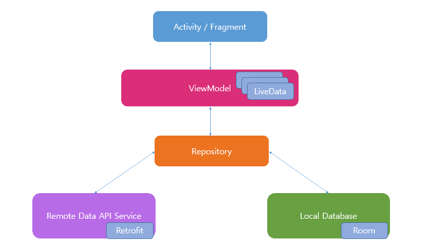

# Reader

Reader 是一个单模块 Android/Kotlin 免费小说阅读器，主模块为 `:app`，Gradle 入口为 `./gradlew`。应用包名为 `com.woodnoisu.reader`，当前仓库配置的版本为 `1.0.3`。

项目保留单模块结构，主要围绕书城、书架、本地阅读、在线阅读和书源管理展开。仓库内的 OpenSpec artifacts 用于规划较大的用户可见行为、架构约束和协作规则变更。

## 当前功能

- 书城：保留固定书源入口，当前代码包含“全文阅读”和“笔趣阁”解析实现，支持分类、搜索、简介、订阅和在线阅读。
- 书源管理：支持书源列表、启停、编辑、删除、二维码导入和 `yuedu://booksource/importonline` 在线导入路径；动态书源接入搜索和阅读链路。
- 书架：支持本地书架展示、取消订阅、书架内过滤搜索、本地 `.txt` 书籍订阅和本地阅读。
- 书架远程搜索：支持“搜书源”聚合已启用书源，并在远程结果中展示来源、分类、连载状态、最新章节、简介和书源提供的字数字段。
- 阅读器：支持目录、亮度、日夜模式、缓存、字体、字号、翻页模式、背景和书签相关交互。
- 个人配置：包含缓存清理、跳转 GitHub 和书源管理入口。

## 技术栈

- Android 单模块应用：`:app`
- Kotlin `1.7.22`
- Android Gradle Plugin `7.4.2`
- Gradle Wrapper `7.6.1`
- SDK：`minSdk 21`，`compileSdk 31`，`targetSdk 30`
- AndroidX、ViewModel、LiveData、Room、Hilt、Coroutines、Flow
- Retrofit、OkHttp、Jsoup、Moshi、Gson、JsonPath
- ZXing Lite、Glide、Coil、Paging、DocumentFile
- 单元测试依赖包含 JUnit、Robolectric、MockWebServer、Mockito、Turbine

## 目录结构

```text
.
├── app/                         # Android 主模块
│   └── src/
│       ├── main/java/com/woodnoisu/reader/
│       │   ├── ui/              # Activity/Fragment/Adapter/ViewModel
│       │   ├── repository/      # 数据读取、缓存、网络/数据库协调
│       │   ├── persistence/     # Room database 和 DAO
│       │   ├── network/         # 固定书源、动态规则解析和网络请求
│       │   └── model/           # 业务模型和书源规则模型
│       ├── test/                # JVM 单元测试
│       └── androidTest/         # 设备/仪器测试
├── openspec/                    # OpenSpec 配置、active changes 和 specs
├── screenshot/                  # 当前仓库可见的架构图资源
├── AGENTS.md                    # Agent 协作规则
├── CHANGELOG.md                 # 可确认变更记录
├── dependencies.gradle          # 版本号和依赖版本集中配置
├── build.gradle
├── settings.gradle
└── README.md
```

## 本地环境

建议使用 Android Studio 或命令行 Gradle 构建。当前仓库的 legacy Android/Gradle 基线建议使用 JDK 11；如果使用较新的 Android Studio bundled JDK 遇到 KAPT 或旧工具链错误，优先把 Gradle JDK 切回 JDK 11。

确认本地 Android SDK 至少包含 `compileSdk 31`。如果从旧的多模块分支或其它工作区切换过来，先确认没有残留的 `buildSrc/`、`feature*/`、`library*/` 或旧 `build/` 目录影响当前单模块构建。

## 常用命令

```bash
# 构建 debug APK
./gradlew :app:assembleDebug

# 运行 JVM 单元测试
./gradlew :app:testDebugUnitTest

# 运行 lint
./gradlew :app:lintDebug
```

OpenSpec 和文档类变更常用检查：

```bash
openspec validate <change-id> --strict
openspec validate --all --strict
git diff --check
```

设备验证需要单独说明执行范围。安装成功、冷启动成功和日志无崩溃不等于已经验证完整交互流程；涉及 UI、资源、Manifest、DI、Room schema 或启动路径时，应按风险补充真实设备检查。

## OpenSpec 工作流

较大的用户可见行为、架构约束或协作规则变更默认通过 `openspec/changes/<change-id>/` 规划。常见流程：

- 先出方案：创建或更新 `proposal.md`、`design.md`、`tasks.md` 和 `specs/**/spec.md`，不改实现代码。
- 实施方案：按 `tasks.md` 顺序实施，保持任务勾选和实际验证一致。
- review：同时检查 OpenSpec artifacts、当前 diff、架构边界、测试和文档。
- 完成提交/归档：只在明确要求时执行，不默认提交、不 push、不 archive。

## APK 下载

现有 APK 下载链接沿用原 README：

- [reader_v1.0.2](https://raw.githubusercontent.com/woodwen/reader/main/apk/reader_v1.0.2.apk)

当前仓库未发现本地 `apk/` 目录，本次文档更新未验证该外链是否为最新发布版本，因此不把它称为“最新应用下载地址”。

## 应用展示

以下应用截图链接沿用原 README 的远程地址，当前仓库本地未发现对应 `1.jpeg` 到 `6.jpeg` 文件：


架构图：



## 参考项目

- [Pokedex](https://github.com/skydoves/Pokedex)：单项目 MVVM、Flow 参考。
- [NovelReader](https://github.com/newbiechen1024/NovelReader)：基于“任阅”的改进追书 App。
- [FreeNovel](https://github.com/lxygithub/FreeNovel)：基于 Kotlin 的免费 Android 小说应用。
- [OKBook](https://gitee.com/xcode_xiao/OKBook)：Kotlin、协程、MVVM 小说阅读 App。

## 历史说明

原 README 提到曾经维护单模块和多模块两个分支。当前仓库以单模块 `:app` 为准，不主动拆模块：

- [单模块版本](https://github.com/woodwen/reader/tree/dev-single)
- [多模块版本](https://github.com/woodwen/reader/tree/dev-multiple)

原 README 中的部分“准备加入”方向属于历史计划，例如隐藏书城、语音朗读等。后续如果要继续推进，应先通过 OpenSpec change 明确范围、验收标准和验证计划。

## 免责声明

该项目不定时维护更新。项目涉及的小说内容来自外部站点或用户配置书源，如有侵权内容，请联系删除。
